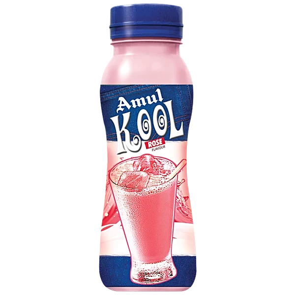

# 🥤 Amul Kool Landing Page

An immersive, premium scroll-driven product experience built with frame-based storytelling.

  

## The Vision

The goal of this project was to transform a traditional product landing page into a highly interactive, high-end "juice brand" experience. By anchoring the user journey around a continuously flowing liquid animation and a beautifully synchronized floating bottle, the interface feels alive, dynamic, and incredibly engaging.

## 🛠️ Tech Stack

*   **HTML5 / CSS3:** Core structure and fluid layouts.
*   **Tailwind CSS:** Rapid, utility-first styling for glassmorphism, gradients, and responsive design.
*   **JavaScript (ES6):** Canvas rendering and performance optimization.
*   **GSAP & ScrollTrigger:** Complex timeline sequencing, pinning, and frame-by-frame scroll animations.

## The Approach

The core of the experience relies on a sequence of meticulously extracted frames rather than standard video playback. The workflow involved:

1.  **Visual Generation:** Product image → Google Flow visuals & video.
2.  **Asset Extraction:** Extracted exactly 210 high-quality `.jpg` frames from the video.
3.  **UI Construction:** Built a Stitch-generated UI with a seamless, liquid-like aesthetic.
4.  **Animation Integration:** Applied GSAP ScrollTrigger animations to tie the DOM elements directly to the canvas frame sequence.

## UI Strategy & Aesthetics

*   **Frame-wise Canvas Rendering:** Instead of fighting video buffering or autoplay restrictions, we draw image frames directly onto an HTML `<canvas>`. The scroll position calculates the exact frame to render, giving the user perfect 1:1 control over the "video" playback.
*   **Premium Glassmorphism:** Heavy use of frosted glass (`backdrop-blur`), soft drop shadows, and semi-transparent layers to give depth to the cards and navigation.
*   **Liquid Gradients:** The sections don't just change color; they flow continuously from soft rose-tinted whites (`#fffafa`) into gentle pink blushes (`#ffe8f0`), mimicking the product itself.
*   **Z-Index Mastery:** carefully layering elements so that the product bottle floats *over* the section backgrounds but dives *behind* specific foreground UI cards.

## 💡 Key Takeaway

> **Rendering videos directly on websites isn't always the best approach.** Frame-wise scroll animations offer significantly smoother performance on scroll, absolute granular control over timing, and a vastly more engaging user experience without the heavy load of video streaming.

---
*Stay Chilled.*
